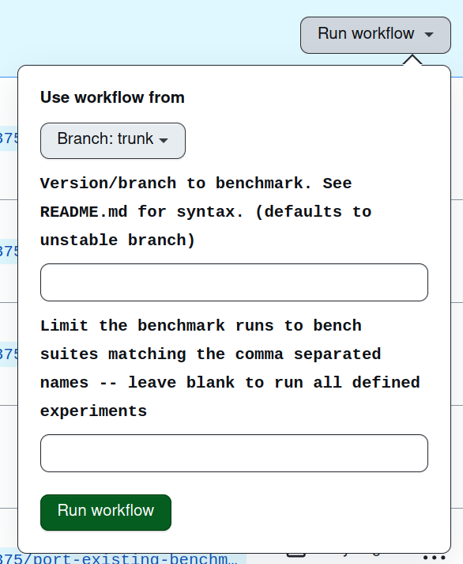

# Apalache Benchtests

<!-- markdown-toc start - Don't edit this section. Run M-x markdown-toc-refresh-toc -->
**Table of Contents**

- [Apalache Benchtests](#apalache-benchtests)
- [Installation and development](#installation-and-development)
    - [Prerequisites](#prerequisites)
    - [Installation](#installation)
    - [Organization](#organization)
        - [Apalache benchmarking framework](#apalache-benchmarking-framework)
        - [Benchmark Projects](#benchmark-projects)
        - [Reports](#reports)
        - [Configuration](#configuration)
- [Adding benchmarks](#adding-benchmarks)
- [Running the benchmarks](#running-the-benchmarks)
    - [Via GitHub actions](#via-github-actions)
    - [Via command-line](#via-command-line)
        - [For all projects](#for-all-projects)
        - [For a specific build of apalache](#for-a-specific-build-of-apalache)
            - [For a released version](#for-a-released-version)
            - [For a branch or commit](#for-a-branch-or-commit)
        - [For a specific project](#for-a-specific-project)
        - [For a particular subset of bench suites](#for-a-particular-subset-of-bench-suites)
        - [Generating reports and the website](#generating-reports-and-the-website)
            - [Updating the reports and site content](#updating-the-reports-and-site-content)
            - [Publishing the site to gh-pages](#publishing-the-site-to-gh-pages)
        - [Debugging](#debugging)
            - [Debugging tasks](#debugging-tasks)
            - [Debugging benchexec](#debugging-benchexec)

<!-- markdown-toc end -->
  

# Installation and development

## Prerequisites

- [sbt](https://www.scala-sbt.org/1.x/docs/Setup.html)
- [benchexec](https://github.com/sosy-lab/benchexec/blob/main/doc/INSTALL.md)
- [direnv](https://direnv.net/) or run `source ./.envrc`

## Installation

The benchmarking framework is not currently packaged separately from this
repository so installing the framework locally currently means cloning this
repo:

``` sh
git clone git@github.com:informalsystems/apalache-bench.git
```

## Organization

### Apalache benchmarking framework

The Apalache benchmarking framework is written as two
[sbt](https://www.scala-sbt.org) plugins.

- `sbt-benchexec` is defined in [`project/sbt-benchexec`](project/sbt-benchexec)
  and provides an eDSL for generating benchexec definitions and sbt tasks for
  running benchexec and generating reports from the results.
- `sbt-apalache` is defined in [`project/sbt-apalache`](project/sbt-apalache) and
  provides tasks for fetching and installing released apalche, either from its
  releases or by building from source.

### Benchmark Projects

The benchmarks can be organized into sbt sub-projects. Each project consists of
a directory holding a `build.sbt` file and the source code used to define the
specs to be run in the benchmarks. For an example of a working project, see the
[performance](peformance) directory.

### Reports

Report data are stored in [`src/site/`](src/site/). The assets in this directory
are then served from github pages.

### Configuration

The top-level configuration for the benchmarks run from this repo is the
[build.sbt](build.sbt) file.

This configures

- the sbt *projects* that define subsets of thematically related projects (e.g.,
  the `performance` benchmarks)
- some data necessary for publishing the reports to github pages
- the list of `benchmarksLongitudinalVersions`, which are the versions of
  Apalche to include in the "Longitudinal Comparison of Experiments" reports.

Each project also has a `build.sbt` file in its directory. This is where the
definition of the tasks to run for the benchmarks are defined. For an example,
see [`performance/build.sbt`]. For documentation on how to add a new benchmark,
see [adding benchmarks](#adding-benchmarks).

# Adding benchmarks

Benchmarks are added to a [projects](#benchmark-projects) by adding a benchmark
suite to the sequence of `benchmarks` defined in the project's `build.sbt`
configuration. Here is an annotated example:

```scala
// The eDSL for defining benchmark executions
import BenchExecDsl._

// The sbt-benchexec plugin
enablePlugins(BenchExec)

// The set of benchmark suites that are part of this project
benchmarks ++= Seq(
  Bench.Suite(
    name = "suite-name",
    // The sub tasks that are collected as part of this suite
    runs = Seq(
      // A collection of commands that all run on the same specification files
      Bench.Runs(
        // The name for the collection of commands
        "APAEWD840",
        timelimit = "3h",
        // The commands to run (all called with apalache)
        cmds = Seq(
          Cmd(
            // a name for the command configuration
            "no init",
            // The options to pass to apalache-mc
            Opt("check"),
            Opt("--inv", "InvAndTypeOK"), // passed as --inv=InvAndTypeOk
            Opt("--length", 0),
            Opt("--cinit", "ConstInit10"),
          ),
          Cmd(
            "--init=InvAndTypeOK",
            Opt("check"),
            Opt("--init", "InvAndTypeOK"),
            Opt("--inv", "InvAndTypeOK"),
            Opt("--length", 1),
            Opt("--cinit", "ConstInit10"),
          ),
        ),
        // The set of file to run each command on
        tasks = Seq(Tasks("APAEWD840", Seq("ewd840/APAEWD840.tla"))),
        // Optional group ID used to group results into disjoint sets
        // in reports. Most benchmarks can simply ommit the group id.
        group = Some("group-id")
      ),
)
```

For a complete working example, see [performance/build.sbt](performance/build.sbt).

# Running the benchmarks

The benchmarks run against the latest `unstable` branch every weekend, and the
results are published. The following instructions are for if you want to
manually run the benchmarks.

**NOTE:** The Apalache benchmarking framework is only compatible with Apalache
\>= `v0.22.0`.

## Via GitHub actions

- Navigate to https://github.com/informalsystems/apalache-bench/actions/workflows/main.yml
- Select `Run workflow` and fill in the fields:
 
  

  - To benchmark a released version, prefix the version tag with `@`. E.g., to
    benchmark version `0.24.0`, supply `@v0.24.0`.
  - To benchmark a branch or commit, prefix the identifier with `#`. E.g., to
    benchmark branch `my-feature`, supply `#my-feature`.
  - You can run a specific set of suites, by supply a comma separated list of
    suite names. E.g., `001indinv-apalache,010encoding-SetAdd`.

## Via command-line

### For all projects

``` sh
sbt benchmarksReport
```

### For a specific build of apalache

#### For a released version

Prefix the tag corresponding to the version with `@`. E.g.:

``` sh
sbt 'set apalacheVersion := "@v0.22.0"; benchmarksReport'
```

#### For a branch or commit

Prefix the branch name or commit ref with `#`. E.g.:

``` sh
# For a branch
sbt 'set apalacheVersion := "#unstable"; benchmarksReport'
# For a specific commit
sbt 'set apalacheVersion := "#c1ed9ef1596bb6e8df6b4f77a8335448eebfa80f"; benchmarksReport'
```

### For a specific project

The general recipe for running benchmarks and generating reports for a specific project is:

``` sh
sbt {project}/benchmarksReport
```

E.g., To run the benchmarks and produce reports for the [performance](./performance)
project, run:

``` sh
sbt performance/benchmarksReport
```

### For a particular subset of bench suites

You can limit the benchmarks run to specific bench suites by setting
`ThisBuild/benchmarksFilterExperiments` to a set with the names of the
experiments to run. E.g., to only run benchmark suites named "foo" and "bar",
you can run:

``` scala
sbt set ThisBuild/benchmarksFilterExperiments := Set("foo", "bar"); performance/benchmarksReport
```

### Generating reports and the website

#### Updating the reports and site content

To generate the site that gather and presents the report data, run

``` sh
sbt site/benchmarksLongitudinalUpdate site/benchmarksIndexUpdate makeSite
```

This will update the files in [./src/site](./src/site). Open
[./src/site/index.html](./src/site/index.html) in your browser to preview the
site locally.

#### Publishing the site to gh-pages

This is done via our GitHub workflow. See
[.github/workflows/main.yml](.github/workflows/main.yml).

### Debugging

#### Debugging tasks

The files generated by Apalache for each run, including the `detailed.log`, are
saved into `site/reports/${verion}/${experiment}/${name}.files`, where

- `version` is the version of Apalache that was benchmarked
- `experiment` is the name of the experiment run
- `name` is the name and timestamp of the particular set of tasks executed

#### Debugging benchexec

Enable debug logging in benchexec by setting the environment variable

```sh
BENCH_DEBUG=true
```
